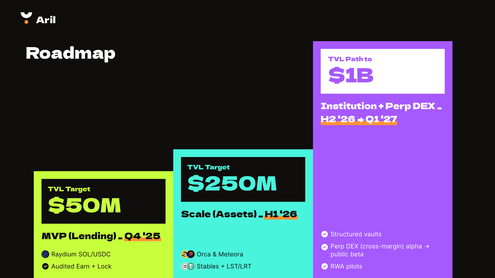
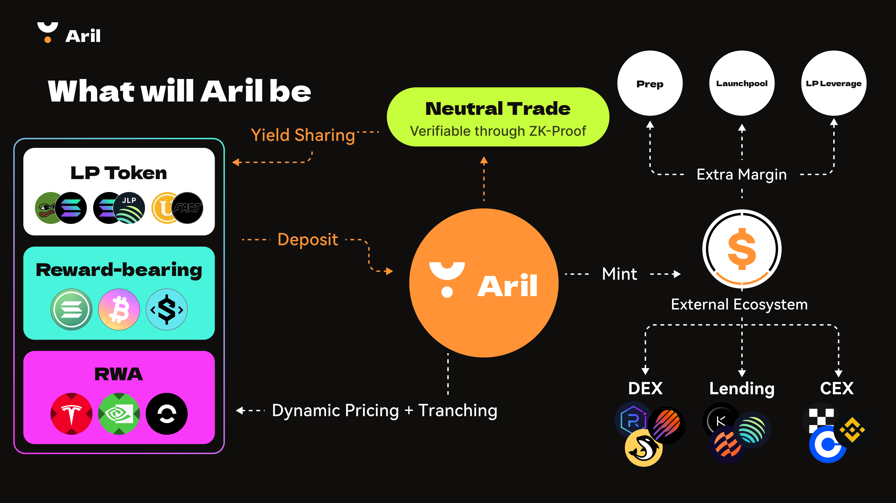

# Roadmap

<figure><figcaption></figcaption></figure>

### H1'26 — Scale assets & venues

Aril will broaden the collateral and add venues so deposits compound while unlocking more borrowing power.

* Add AMM integrations (e.g., Orca, Meteora)&#x20;
* List stablecoins, LST/LRT, and selected LP tokens
* Upgrade dynamic pricing and tranching; clearer disclosures on yield sources and capacity
* Neutral strategy vaults&#x20;
* Risk engine upgrade with venue-aware limits, stress testing, and simulation playbooks

<figure><figcaption></figcaption></figure>

### Q1'27 — Institutions & Perp DEX

Introduce cross-margin perps and institutional rails so reward-bearing collateral remains productive while serving as trading margin.

* Structured vaults with configurable risk bands and transparent accounting
* Perp DEX rollout from alpha to public beta;
* USDA pilot for internal settlement and margin
* Neutral-trade verification via attestations, progressing toward ZK-verifiable proofs
* Cross-venue liquidation router spanning DEX and optional CEX paths&#x20;
