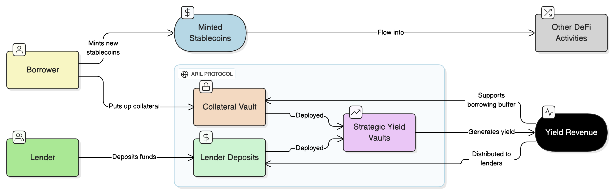

# Lending

The core mission of finance is to achieve the optimal allocation of resources. As the oldest form of finance, lending perfectly embodies this value proposition. In the DeFi world, although the lending sector has matured, it still faces the bottleneck of capital efficiency under the over-collateralization model. The Aril protocol redefines decentralized lending through an innovative dual-track architecture, achieving the unification of security and capital efficiency.

<figure><figcaption>
Aril Lending Workflow
</figcaption></figure>

### Innovative Architecture: Dual-Track Flow and Yield Stratification

As shown in the figure, the Aril protocol has established a clear capital flow path:

* **Borrower Track**: After users deposit collateral into the Collateral Vault, they can mint new stablecoins for use in other DeFi activities.
* **Lender Track**: Lenders deposit funds to form Lender Deposits, which are deployed together with collateral into Strategic Yield Vaults to enhance yields.

### Yield Engine and Risk Buffer

The Strategic Yield Vaults are the core innovation of the system, continuously generating Yield Revenue through professional strategies. This portion of yield is intelligently allocated: part is distributed to lenders as returns, and the other part is automatically converted into borrowing buffer funds. This design not only ensures lenders' yields but also provides an economic foundation for the system's zero-interest lending.

### Three-Dimensional Innovative Value

Compared with traditional lending protocols, Aril has achieved three key breakthroughs:

* **Multiplied Capital Efficiency**: Collateral is no longer idle but continuously creates value through yield vaults.
* **Optimized Risk Structure**: The buffer layer formed automatically by yields significantly reduces liquidation risks.
* **Revolutionized User Experience**: Borrowers enjoy zero-interest lending, while lenders obtain stable yields.

Aril represents a new DeFi architectural philosophy: through the refined design of capital pathways, it achieves capital efficiency comparable to that of traditional finance while maintaining decentralized risk control. This innovation not only addresses the core pain points of the current lending market but also provides a new paradigm for the sustainable development of the DeFi ecosystem.\
