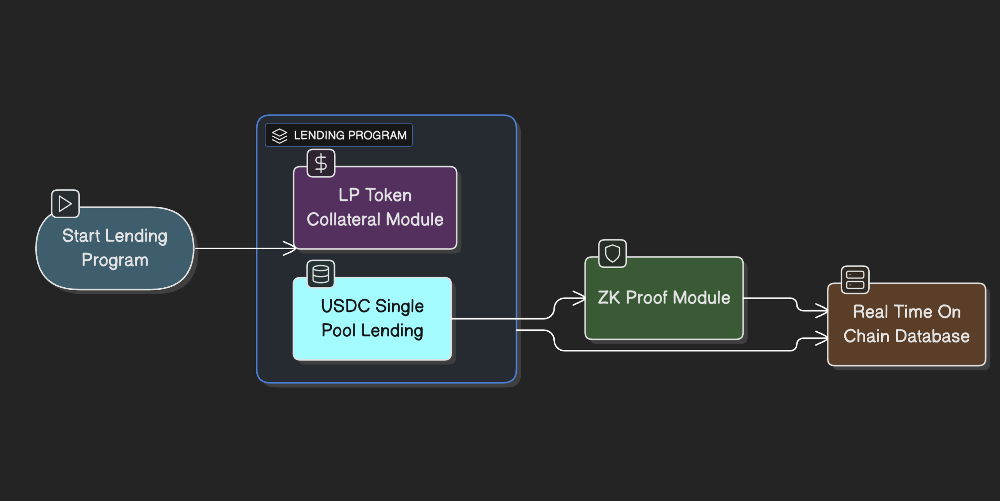

# Architecture

### **1. Introduction​​**

Aril is engineered to solve key challenges in the DeFi space: unlocking liquidity for liquidity providers (LPs) and providing a secure, transparent yield source for capital depositors. This document outlines the core components and data flow of our system, which is built for security, transparency, and high performance.

### **​​2. Core Architectural Components​​**

The Aril protocol is structured around four primary modules that work in concert to create a seamless and trust-minimized financial ecosystem. The data flow begins with the initiation of the lending program and moves through the core logic, verification layer, and finally to data persistence.

<figure><figcaption></figcaption></figure>

#### **2.1. Lending Program** ​

The `LENDING PROGRAM` smart contract acts as the protocol's central engine and orchestrator. It is responsible for managing the overall state of the system, coordinating interactions between the other modules, and enforcing the core business logic.

* ​**​Function:​**​ Core state management and protocol orchestration.
* ​**​Key Features:​**​
  * Manages user accounts and global reserves.
  * Calculates and distributes interest rates.
  * Enforces loan-to-value (LTV) ratios and liquidation conditions.

#### ​​2.1.1. LP Token Collateral Module​​

This module is a key innovation of the Aril protocol. It allows users to borrow USDC by depositing their Liquidity Provider (LP) tokens from external Automated Market Makers (AMMs) as collateral. This functionality unlocks the dormant capital within LP positions, providing liquidity without requiring users to exit their farming strategies.

* ​**​Function:​**​ Enables borrowing against LP token collateral.
* ​**​Key Features:​**​
  * Accepts a wide range of pre-approved LP tokens from major DEXs.
  * Utilizes secure oracle feeds to determine the real-time value of the deposited LP tokens.
  * Manacles the collateral factors and liquidation thresholds for each LP token type.

#### ​**​****2.1.2. USDC Single Pool Lending Module​**​

To create a seamless flow of liquidity, this module operates a single-sided USDC pool. Lenders can deposit USDC into this pool to earn yield generated from the interest paid by borrowers and our in house yield strategy.&#x20;

* ​**​Function:​**​ Facilitates single-asset deposits for yield generation.
* ​**​Key Features:​**​
  * A unified liquidity pool for USDC deposits.
  * Automatic yield distribution based on protocol utilization rates.

#### ​**​2.2. ZK Proof Module** ​

A cornerstone of Aril's security and trust model is the `ZK PROOF MODULE`. This component is critical for our off-chain yield generation strategies (e.g., on centralized exchanges - CEX). It generates zero-knowledge proofs (ZK-proofs) that cryptographically verify the correctness of our strategy execution without revealing the proprietary strategy logic itself.

* ​**​Function:​**​ Generates verifiable proofs for off-chain activity.
* ​**​Key Features:​**​
  * ​**​Proof of Solvency:​**​ Verifies that the protocol's off-chain assets back the on-chain liabilities.
  * ​**​Proof of Correct Execution:​**​ Attests that all off-chain trades and operations were performed according to the promised, pre-committed strategy rules.
  * Enhances security and transparency while fully preserving strategy intellectual property.

#### ​**​2.3. Real-Time On-Chain Database** ​

To deliver a user experience comparable to top-tier centralized exchanges, Aril employs a `REAL-TIME ON-CHAIN DATABASE`. This component indexes and stores all protocol events, transaction histories, and market data in an optimized, queryable database. It serves as the high-performance data backbone for our frontend application and analytics.

* ​**​Function:​**​ Provides indexed, low-latency access to blockchain data.
* ​**​Key Features:​**​
  * Specialized indexers that listen to on-chain events from the core protocol.
  * Powers the frontend, enabling instant updates on user positions, portfolio value, and market status.
  * Provides a robust foundation for advanced analytics, dashboards, and data-driven insights.

### **​​3. System Workflow & Data Flow​​**

1. A user initiates an action via the frontend, which interacts with the `LENDING PROGRAM`.
2. The `LP Token Collateral Module` processes collateral deposits/withdrawals and loan origination/repayment.
3. The `USDC Single Pool Lending Module` handles lender deposits and withdrawals, managing the liquidity pool.
4. Data from both lending modules, along with results from off-chain strategies, are fed into the `ZK Proof Module` for continuous verification.
5. The resulting proofs and all on-chain transaction data are recorded in the `Real-Time On-Chain Database`.
6. The frontend queries this database to provide users with instant, clear, and accurate information.

### **​​4. Conclusion​​**

The architecture of Aril is meticulously designed to be both powerful and efficient. By synergistically combining a dual-sided lending model with a zero-knowledge verified security layer and a high-performance data indexer, we create a protocol that is not only capital-efficient but also fundamentally more transparent and secure. This robust technical foundation positions Aril as a leading innovator in the DeFi lending space.
